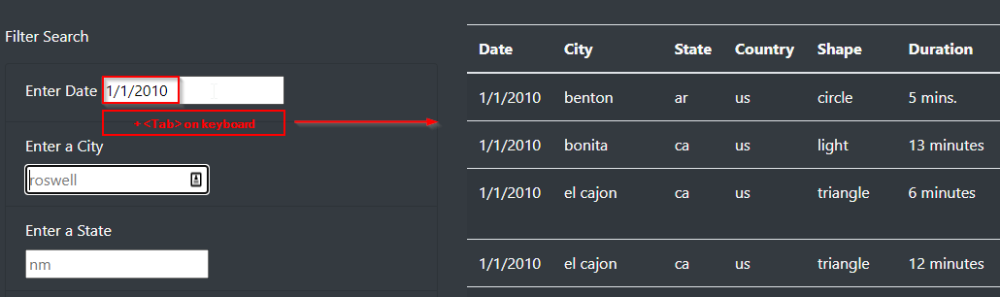
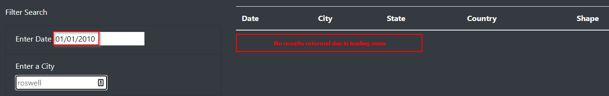
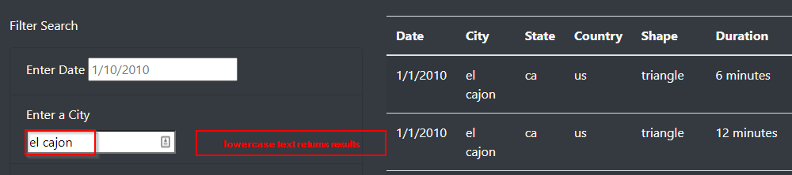
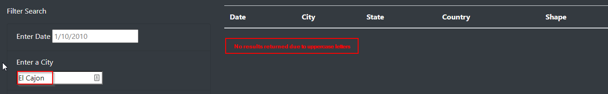
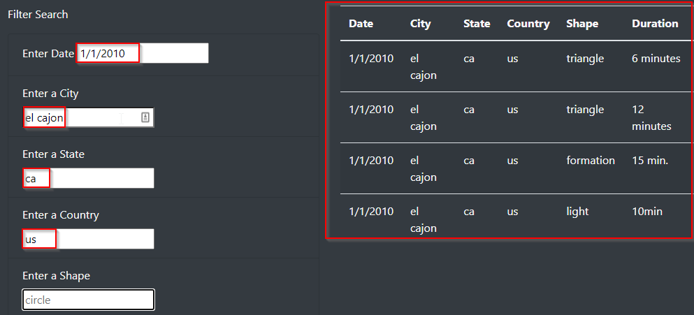

# UFO Sightings Interactive WebPage

## Overview of the Analysis:

In this module, we created an interactive webpage to display UFO sightings data in a table equipped with filters allowing users to parse data about these events. In the background, the data is stored as a JavaScript array. JavaScript works hand-in-hand with HTML to facilitate effective data visualizations. We also utilized a popular JavaScript library, D3.js, to enable an event listener that would respond to user input (e.g. button click, text entry). We also utilized Bootstrap's content delivery network (CDN) to customize our webpage.   

## User Guide:

The webpage provides multiple **filters** to peruse the UFO sightings data: 
- date 
- city 
- state 
- country 
- shape 

  - Users are welcome to use one or multiple filters as desired. 
  - Each of the filters requires numeric/date or alpha text input. 
  - After entering date or alpha text in the applicable filter field, **press the Tab key** on your keyboard or **click into another field with your mouse** to return the filtered results.

**Please Note:** 
- The date should be entered into the date filter **without leading zeros for the month or day** to successfully return UFO sighting results. 
  - Only data for **January 1, 2010 through January 13, 2010** is available for review and filtering. 

**Correct Date Entry - No Leading Zeros - Results Returned:** 

**Incorrect Date Entry - Leading Zeros - No Results Returned:** 

- All **alpha text inputs** should be **lowercase** to successfully return results.   

**Lowercase City - Results Returned:** 

**Uppercase City - No Results Returned:**  

**Multiple Filters Populated:**

## Summary:

While users are able to successfully filter through the UFO sightings data on the webpage, there are a couple of drawbacks to the current configuration.

### Drawbacks:  

- One drawback of this webpage is that alpha text inputs are case-sensitive and must be entered in lowercase for the filters to work. For example, if you enter "El Cajon" instead of "el cajon," the filter will not return any results. I suspect this may be due to the format of the data itself since the key-value pairs in the data.js file are all in lowercase. I'm unsure if there is a way around this programmatically, but it is not very intuitive from a user perspective.

- Another drawback is that the date must be entered without a leading zero for both the month and day in order to return results. For example, the user must enter 1/1/2010 rather than 01/01/2010 in order to return filtered results. 

### Recommendations for Future Enhancements: 

- One proposed quality-of-life enhancement would be to add a **"Reset" button** that would clear all filters with a click of a button rather than having to delete the filter manually and then pressing <Tab> or clicking into another field to reset the page. 
- Adding more data for a **wider range of dates,** rather that limiting data to January 2010, would give users the ability to gain insights about UFO sightings over time. This would be best accomplished through an API, if one exists, rather than through a limited js data file.  
